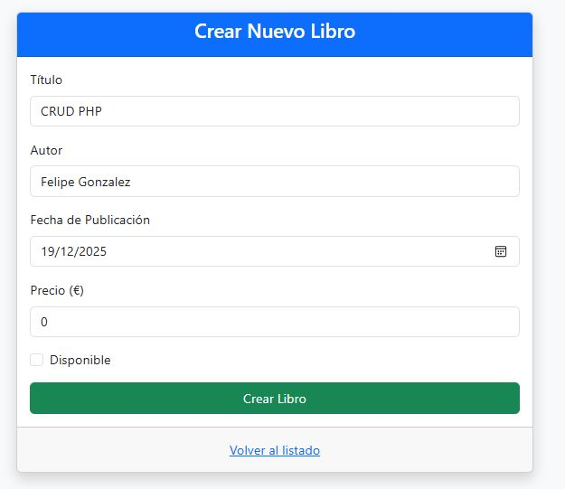
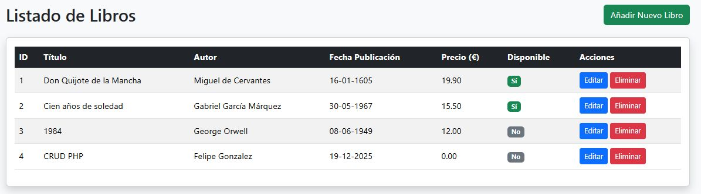
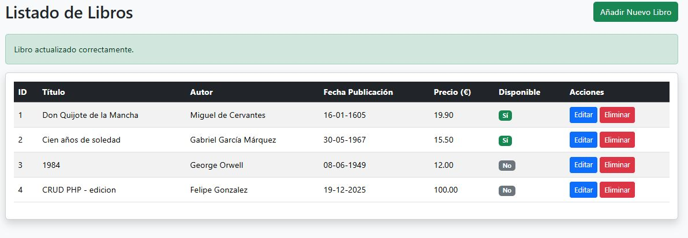
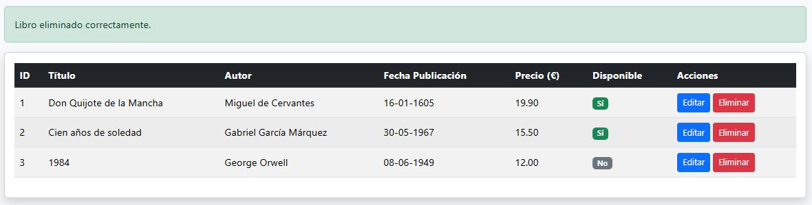

# 📚 CRUD de Libros — MVC en PHP

Aplicación web desarrollada en **PHP** siguiendo el patrón **Modelo–Vista–Controlador (MVC)**.  
Permite gestionar un catálogo de libros mediante operaciones CRUD: crear, listar, editar y eliminar.  
Incluye interfaz en **Bootstrap 5** y conexión a base de datos mediante **PDO**.

---

## 🚀 Características

- Arquitectura MVC real  
- CRUD completo de libros  
- Vistas con Bootstrap 5  
- Consultas preparadas (PDO)  
- Sanitización de datos en entradas de usuario  
- Código limpio, modular y fácil de ampliar  

---
## 📁 Estructura del Proyecto

```txt
/Libros_mvc/
│
├── config/
│   └── Database.php
│
├── controllers/
│   └── LibroController.php
│
├── models/
│   └── Libro.php
│
├── views/
│   └── libros/
│       ├── listar.php
│       ├── crear.php
│       └── editar.php
│
├── public/
│   ├── assets/
│   ├── crearView.jpg
│   ├── editarView.jpg
│   ├── eliminarView.jpg
│   ├── libroEditado.jpg
│   └── listarView.jpg
│
├── index.php
├── login-php.sql
└── README.md
```

---

## ⚙️ Requisitos
- PHP 7.4 o superior  
- Servidor local (XAMPP, WAMP, Laragon, etc.)  
- MySQL / MariaDB  
- Navegador moderno 

---
## 🔧 Instalación

1. Clona el repositorio:
   ```bash
   git clone https://github.com/fgonmar445/Libros_mvc
    ```
2. Importa la base de datos:
- Abre phpMyAdmin
- Crea una base de datos llamada login-php
- Importa el archivo login-php.sql

3. Configura la conexión en config/database.php:
    ```bash
    $this->conn = new PDO("mysql:host=localhost;dbname=crud_libros", "root", "");
    ```
4. Inicia el servidor local:
    ```bash
    php -S localhost:8000 -t public
    ```
5. Abre en el navegador:
    ```bash
    http://localhost:8000
    ```
---

# 🗄️ **Esquema de la Base de Datos**

```sql
CREATE TABLE libros (
    id INT AUTO_INCREMENT PRIMARY KEY,
    titulo VARCHAR(255) NOT NULL,
    autor VARCHAR(255) NOT NULL,
    precio DECIMAL(10,2) NOT NULL,
    fecha_publicacion DATE NOT NULL,
    disponible TINYINT(1) NOT NULL
);
```
---

# 🧩 **Funcionalidades del CRUD**

- **Crear libro:** formulario con validación JS y sanitización PHP  
- **Listar libros:** tabla responsive con Bootstrap  
- **Editar libro:** carga de datos por ID y actualización segura  
- **Eliminar libro:** confirmación antes de borrar  
- **Formato europeo de fechas:** `DD-MM-YYYY` en la vista  
- **Booleanos como checkbox:** marcado/no marcado
---

## 📸 Interfaz del CRUD

### ✨ Crear Libro
> Formulario para añadir un nuevo libro al sistema.


### 📚 Listar Libros
> Vista principal donde se muestran todos los libros registrados.


### 🛠 Editar Libro
> Modificación de los datos de un libro existente.


### ✔ Libro Editado
> Resultado después de guardar los cambios.


### 🗑 Eliminar Libro
> Confirmación antes de borrar un registro.

